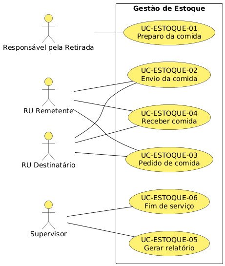

# Sistema de Gerenciamento de Logística
## Restaurantes Universitários da UFF

**Universidade Federal Fluminense**
*Instituto de Computação - Engenharia de Software*

---

## Agenda

1. **Motivação do Projeto**
2. **Escopo do Sistema**
3. **Módulo Estoque**
4. **Módulo Fila Virtual**
5. **Módulo Receitas e Nutrição**
6. **Conclusões e Impactos**

---

# Motivação do Projeto

---

## Problemas Atuais nos RUs

### **Desafios Operacionais:**
- **Filas longas** e tempo de espera elevado
- **Falta de transparência** sobre disponibilidade
- **Gestão manual** de estoque ineficiente
- **Desperdício** de alimentos
- **Dificuldade de controle** nutricional

---

### **Impacto nos Usuários:**
- **Perda de tempo** dos estudantes e funcionários
- **Incerteza** sobre horários e disponibilidade
- **Experiência frustrante** no RU

---

## Oportunidade
### **Sistema de Gerenciamento dos Restaurantes Universitários da UFF em Niterói**

---

# Escopo do Sistema

---

## Visão Geral do Sistema

O sistema gerencia a **logística** e os **serviços** fornecidos pelos restaurantes universitários da UFF em Niterói.

### **Três Módulos Principais:**
- **Gestão de Estoque** - Controle de insumos e alimentos
- **Fila Virtual** - Organização e fluxo de usuários
- **Receitas e Nutrição** - Qualidade e informações nutricionais

---

## Usuários do Sistema

- **Funcionários dos restaurantes**
- **IdUFF**

---

# Módulo Estoque

---

## Requisitos Funcionais - Estoque

### **Gerenciamento de Inventário:**
- **RF3.1:** Armazenar quantidade de ingredientes
- **RF3.2:** Armazenar quantidade de alimentos prontos
- **RF3.3:** Editar quantidades em estoque
- **RF3.4:** Consultar ingredientes disponíveis
- **RF3.5:** Controlar prazo de validade

---

### **Transferência entre RUs:**
- **RF3.6:** Solicitar envio de alimentos
- **RF3.7:** Monitorar informações de viagem
- **RF3.8:** Receber e confirmar entregas
- **RF3.9:** Alertar sobre estoque mínimo

---

## Requisitos Não-Funcionais - Estoque

### **Performance e Segurança:**
- **RNF3.1:** Atualização em tempo real do estoque
- **RNF3.2:** Suporte a múltiplos acessos simultâneos
- **RNF3.3:** Proteção de dados sensíveis (custos, fornecedores)

---

### **Relatórios:**
- **RNF3.4:** Geração de relatórios de consumo
- **RNF3.5:** Registro de sobras e desperdício

---

### **Preparo de Comida**
1. Responsável pela Retirada retira quantidade de insumo necessária
2. Sistema registra baixa no estoque
3. Sistema atualiza quantidades de ingredientes
4. Sistema atualiza quantidades de alimentos prontos
5. Cozinheiros preparam a comida

---

### **Cenários Alternativos:**
- **Limite mínimo atingido:** Notificação automática ao responsável
- **Erro no preparo:** Descarte e reinício do processo

---

### **Envio da Comida:**
1. Consulta quantidade disponível no estoque
2. Retira quantidade e executa baixa no sistema
3. Confirma saída e notifica unidade destinatária

---

### **Pedido de Comida:**
1. RU destinatário solicita envio de alimentos
2. RU fornecedor recebe e avalia solicitação
3. Sistema registra aceite ou negação do pedido
4. Notifica resultado da decisão

---

### **Recebimento:**
1. RU destinatário confere entrega recebida
2. Notifica chegada com sucesso ao fornecedor
3. Sistema atualiza quantidades no estoque

---

### **Relatórios e Fim de Serviço:**
- Supervisor define parâmetros de consulta
- Sistema consolida dados históricos
- Registro de término e quantidades remanescentes

---

## Diagrama de Casos de Uso - Estoque

---

# Módulo Fila Virtual

---

## Requisitos Funcionais - Fila Virtual

### **Para Usuários:**
- **RF2.1:** Entrar e sair da fila virtual
- **RF2.2:** Visualizar posição e estimativa de tempo
- **RF2.3:** Receber notificações personalizáveis
- **RF2.4:** Confirmar presença em marcos específicos
- **RF2.5:** Retroceder posições na fila
- **RF2.6:** Enviar feedback sobre experiência

---

### **Para Administradores:**
- **RF2.7:** Monitorar painel em tempo real
- **RF2.8:** Configurar capacidade e prioridades
- **RF2.9:** Gerar relatórios históricos
- **RF2.10:** Integrar com sistema de catracas

---

## Requisitos Não-Funcionais - Fila Virtual

### **Performance e Disponibilidade:**
- **RNF2.1:** Atualização de posição a cada minuto
- **RNF2.2:** Disponibilidade durante 2h15min por refeição
- **RNF2.3:** Suporte a múltiplos usuários simultâneos

---

### **Usabilidade:**
- **RNF2.5:** Notificações em tempo real
- **RNF2.6:** Integração com sistema IdUFF

---

### **Fluxo Principal:**
1. Usuário acessa sistema IdUFF
2. Seleciona RU e visualiza capacidade e políticas
3. Escolhe prioridade (se elegível)
4. Sistema valida elegibilidade e saldo
5. Registra entrada e atribui posição
6. Calcula estimativa de espera
7. Agenda notificações conforme preferências

---

### **Cenários Alternativos:**
- **RU fechado:** Sistema informa indisponibilidade
- **Saldo insuficiente:** Solicita recarga via IdUFF
- **Não elegível à prioridade:** Oculta opções especiais

---

### **Sair da Fila:**
1. Usuário aciona "Sair da fila"
2. Sistema solicita confirmação
3. Remove usuário e reordena fila
4. Atualiza estimativas dos demais

---

### **Confirmar Presença:**
1. Sistema dispara prompt em marcos específicos
2. Usuário confirma presença
3. Sistema mantém posição e registra timestamp

---

### **Painel em Tempo Real:**
- Monitoramento de pessoas na fila e horários de pico
- Aplicação de filtros por turno, campus e período
- Integração com dados das catracas físicas

---

### **Configuração Operacional:**
- Definição de capacidade simultânea do refeitório
- Configuração de critérios de prioridade
- Controle de status operacional do RU

---

## Diagrama de Casos de Uso - Fila Virtual

---

# 5. Módulo Receitas e Nutrição

---

## Requisitos Funcionais - Nutrição

### **Controle de Qualidade:**
- **RF4.1:** Aprovar controle de qualidade dos alimentos
- **RF4.2:** Registrar casos de contaminação
- **RF4.3:** Alertar funcionários sobre contaminação
- **RF4.4:** Avaliar qualidade das refeições

---

### **Informações Nutricionais:**
- **RF4.5:** Exibir cardápio do dia
- **RF4.6:** Fornecer informações nutricionais
- **RF4.7:** Registrar valores nutricionais
- **RF4.8:** Gerar relatórios nutricionais consolidados

---

## Requisitos Não-Funcionais - Nutrição

### **Performance:**
- **RNF4.1:** Exibir cardápio em até 2 segundos
- **RNF4.2:** Armazenamento seguro das avaliações
- **RNF4.3:** Transmissão de alertas apenas para perfis autorizados

---

### **Segurança:**
- **RNF4.4:** Proteção contra acesso não autorizado
- **RNF4.5:** Controle de permissões por nível de usuário

---

### **Controle de Qualidade:**
1. Equipe de controle averigua estado da comida
2. Administrador aprova ou reprova qualidade
3. Sistema registra resultado da avaliação
4. Sistema exibe status da aprovação

---

### **Cenário de Reprovação:**
- Sistema registra reprovação
- Notifica supervisores sobre o incidente
- Bloqueia uso do alimento reprovado

---

### **Consulta do Cardápio:**
1. Cliente acessa área de consulta
2. Sistema apresenta restaurantes em operação
3. Cliente seleciona restaurante
4. Sistema exibe cardápio com informações nutricionais

---

### **Registro de Valores Nutricionais:**
1. Administrador acessa seção de gestão alimentar
2. Edita informações nutricionais dos alimentos
3. Sistema persiste alterações no banco de dados

---

### **Relato de Contaminação:**
1. Funcionário acessa área específica de relatos
2. Preenche formulário descritivo do ocorrido
3. Sistema registra incidente
4. Sistema notifica supervisores automaticamente

---

### **Geração de Relatórios:**
- Supervisor solicita relatórios nutricionais
- Sistema gera consolidação baseada em período
- Exibe médias de calorias e nutrientes ofertados

---

## Diagrama de Casos de Uso - Nutrição

---

# Conclusões e Impactos

---

## Benefícios do Sistema

### **Para os Usuários:**
- **Redução** do tempo de espera físico nas filas
- **Transparência** na posição e estimativa de tempo
- **Notificações** personalizadas e em tempo real
- **Acesso** a informações nutricionais detalhadas

---

### **Para a Administração:**
- **Otimização** do fluxo de pessoas e recursos
- **Relatórios** detalhados para tomada de decisão
- **Gestão eficiente** de estoque e inventário
- **Controle rigoroso** de qualidade alimentar

---

## Integração e Tecnologia

### **Integrações Necessárias:**
- **Sistema IdUFF** para autenticação e autorização
- **Catracas físicas** para controle de acesso
- **Sistema de pagamento** para gestão financeira

---

### **Características Técnicas:**
- **Acessibilidade** conforme padrões WCAG
- **Segurança** de dados sensíveis
- **Performance** otimizada para alta concorrência
- **Suporte** a acessos simultâneos múltiplos

---

## Impacto Esperado

### **Melhoria da Experiência do Usuário:**
- Redução significativa de filas físicas
- Maior controle sobre o tempo pessoal
- Transparência nos processos operacionais
- Garantia de qualidade alimentar

---

### **Eficiência Operacional:**
- Otimização de recursos humanos e materiais
- Redução de desperdício alimentar
- Gestão inteligente baseada em dados históricos
- Tomada de decisão fundamentada em métricas

---

# Perguntas e Discussão

**Obrigado pela atenção**

**Universidade Federal Fluminense**
Instituto de Computação
Sistema de Restaurantes Universitários
